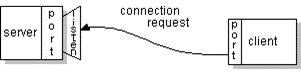
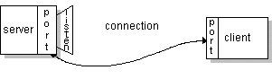
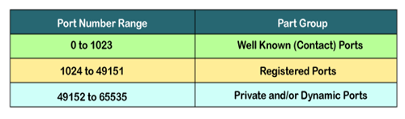

# Basics of Networking for Web Development
The basic intention of this document is to provide basic idea about how the network components used behind web. 

## Network Protocol
A network protocol is a set of established rules that specify how to format, send, and receive data so that computer network endpoints, including computers, servers, routers, and virtual machines, can communicate despite differences in their underlying infrastructures, designs or standards.

To successfully send and receive information, devices on both sides of a communication exchange must accept and follow protocol conventions. In networking, support for protocols can be built into the software, hardware, or both.

Without network protocols, computers and other devices would not know how to engage with each other. As a result, except for specialty networks built around a specific architecture, few networks would be able to function, and the internet as we know it wouldn't exist.

**Source**: https://www.techtarget.com/searchnetworking/definition/protocol

## Socket
Normally, a server runs on a specific computer and has a socket that is bound to a specific port number. The server just waits, listening to the socket for a client to make a connection request.

On the client-side: The client knows the hostname of the machine on which the server is running and the port number on which the server is listening. To make a connection request, the client tries to rendezvous(engage) with the server on the server's machine and port. The client also needs to identify itself to the server so it binds to a local port number that it will use during this connection. This is usually assigned by the system.

If everything goes well, the server accepts the connection. Upon acceptance, the server gets a new socket bound to the same local port and has its remote endpoint set to the address and port of the client. It needs a new socket so that it can continue to listen to the original socket for connection requests while tending to the needs of the connected client.

On the client side, if the connection is accepted, a socket is successfully created, and the client can use the socket to communicate with the server. The client and server can now communicate by writing to or reading from their sockets.

**Summary**:

A socket is one endpoint of a two-way communication link between two programs running on the network. A socket is bound to a port number so that the TCP layer can identify the application that data is destined to be sent to. An endpoint is a combination of an IP address and a port number. Every TCP connection can be uniquely identified by its two endpoints. That way you can have multiple connections between your host and the server.

**Source**: https://docs.oracle.com/javase/tutorial/networking/sockets/definition.html

## Transmission Control Protocol (TCP)
Transmission Control Protocol (TCP) is a global communication standard that devices use to reliably transmit data. TCP is defined by being connection-oriented, which means that both the client and the server must be established before the data gets sent. This means the data is reliable, ordered and error-checked in transit. It is one of the main protocols of the Internet protocol suite — and the entire suite is often referred to as TCP/IP.

A **port number** is a unique identifier used with an IP address. A port is a 16-bit unsigned integer, and the total number of ports available in the TCP/IP model is 65,535 ports. Therefore, the range of port numbers is 0 to 65535. In the case of TCP, the zero-port number is reserved and cannot be used, whereas, in UDP, the zero port is not available. IANA (Internet Assigned Numbers Authority) is a standard body that assigns the port numbers.

192.168.1.100: 7

In the above case, 192.168.1.100 is an IP address, and 7 is a port number. To access a particular service, the port number is used with an IP address. The range from 0 to 1023 port numbers are reserved for the standard protocols, and the other port numbers are user-defined.

**Sources**:
 https://www.cbtnuggets.com/blog/technology/networking/what-is-a-tcp-port-and-why-they-are-important
https://www.javatpoint.com/tcp-port#:~:text=A%20port%20is%20a%2016,zero%20port%20is%20not%20available.

## About Django Port 8000
**Q. I know port 80 is used for as a HTTP protocol. Then how django able to listen on port 8000. It should be 80 right?**

**Response from CHAT GPT3.5:**

Port 80 is the standard port for HTTP traffic. Here's why Django uses port 8000 by default:
- Development vs. Production: Port 80 is typically reserved for web servers running in production environments. Django's built-in development server (runserver) is meant for local development, not serving websites to the public internet.
- Avoiding Conflicts: Using a non-standard port like 8000 prevents conflicts with other software that might already be using port 80 (like Apache or Nginx). This is common practice for development tools.
- Security: By default, Django's development server isn't intended to be super secure. Running it on a non-standard port adds an extra layer of security by making it less accessible from the public internet.

**If you need to run Django on port 80 in production:**

It's not recommended to use Django's development server (runserver) in production due to security limitations. Instead, you'd typically use a production web server like Nginx or Apache in front of Django, configured to listen on port 80 and forward requests to Django on a different port (which could be 8000 or another custom port).

