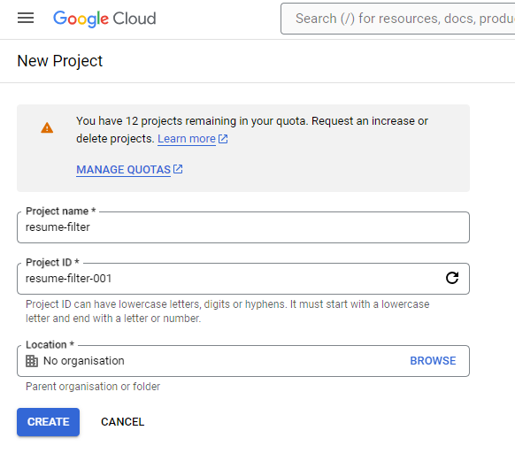

# Google Configuration Setup
In this document, we are going to setup Google configurations which are required to use google as an authenticator in your Django App. You can enable these Google Configuations in Google Cloud platform.

## Creating a New Project in Google Cloud
To create a new project:
- Navigate to [Project Create](https://console.cloud.google.com/projectcreate?previousPage=%2Fwelcome%2Fnew&organizationId=0)
- Provide `Project name` and `Project ID` and click on create


## Generating Credentials for Django App
- Search for `Credentials` in google cloud search box and open `credentials` (with product as Google Workspace)
- Click on `Credentials in APIs and services` which is inside `credential` tab
- Complete the OAuth Consent which is inside `OAuth consent screen` with the information you know. With this consent Google displays a consent screen to the user including a summary of your project and its policies and the requested scopes of access.
- Once you complete OAuth Consent, move to `credential` and click on `+ CREATE CREDENTIALS` and select `OAuth client ID`. 
- Select application type as "Web Application"
- Give `Name` anything you want
- For **Authorized JavaScript origins**, add the following URIs:
  - http://localhost:8000
  - http://127.0.0.1:8000
- Under **Authorized redirect URIs**, add the following URIs:
  - http://127.0.0.1:8000/accounts/google/login/callback/
  - http://localhost:8000/accounts/google/login/callback/
- Click “Create” and note down your “Client ID” and “Client Secret.” We’ll use these later.

## Creating App Password
When configuring Django to send emails using a service like Gmail, you might encounter a requirement to use an app-specific password rather than your regular account password for the EMAIL_HOST_PASSWORD. This requirement is for security reasons and involves the following considerations:

Security Reasons for Using App Passwords
- Limited Access: An app password is a special code that allows an application to access your Google account. It has limited access compared to your main password, which means even if it gets compromised, the damage is minimized.

- Two-Factor Authentication (2FA): If your Google account has two-factor authentication enabled, regular passwords won't work for apps like Django. App passwords bypass the 2FA, allowing the app to authenticate without compromising the overall security setup.

- Revocability: App passwords can be easily revoked without affecting your main account password. If you need to stop access for the app, you can revoke the app password without changing your primary password.
Below are the steps to create app password:
- Click on [Manage your Google Account](https://myaccount.google.com/?hl=en&utm_source=OGB&utm_medium=act)
- Click on `Security`
- Click on `2-Step Verification` and authenticate you mail id.
- Click on `App Passwords`
- Enter your app name and create a password there

## Changes in Main Project
These changes you will perform in your main project

#### modification in setting.py
- ACCOUNT_EMAIL_VERIFICATION: This setting enforces email verification for users who sign up. It ensures that the email address provided by the user is valid and can be used to recover the account or receive notifications.
- ACCOUNT_EMAIL_REQUIRED: This setting makes it mandatory for users to provide an email address during the signup process. It is crucial for sending verification emails and for future communication with the user.
- ACCOUNT_USERNAME_REQUIRED = True  # Require users to provide a username during signup
- ACCOUNT_AUTHENTICATION_METHOD = 'username_email'  # Allow users to log in using either their username or email
- ACCOUNT_USER_MODEL_USERNAME_FIELD = 'username'  # Specify the field name for the username in the user model

```
# Email Verification
ACCOUNT_EMAIL_VERIFICATION = 'mandatory'
ACCOUNT_EMAIL_REQUIRED = True


# Login Settings
LOGIN_REDIRECT_URL = '/'
LOGOUT_REDIRECT_URL = '/'


# Signup Settings
ACCOUNT_USERNAME_REQUIRED = True
ACCOUNT_AUTHENTICATION_METHOD = 'username_email'
ACCOUNT_USER_MODEL_USERNAME_FIELD = 'username' 

# Social Account Settings
SOCIALACCOUNT_PROVIDERS = {
    'google': {
        'SCOPE': [
            'profile',
            'email',
        ],
        'APP': {
            'client_id': '<replace with client id created above>',
            'secret': '<replace with screat key created about>',
            'key': ''
        },
    }
}

# Alternatively, for production:
EMAIL_BACKEND = 'django.core.mail.backends.smtp.EmailBackend'
EMAIL_HOST = 'smtp.gmail.com'
EMAIL_PORT = 587
EMAIL_USE_TLS = True
EMAIL_HOST_USER = '<replace_with_your_gmail>'
EMAIL_HOST_PASSWORD = '<replace with your less secure app password>'
```